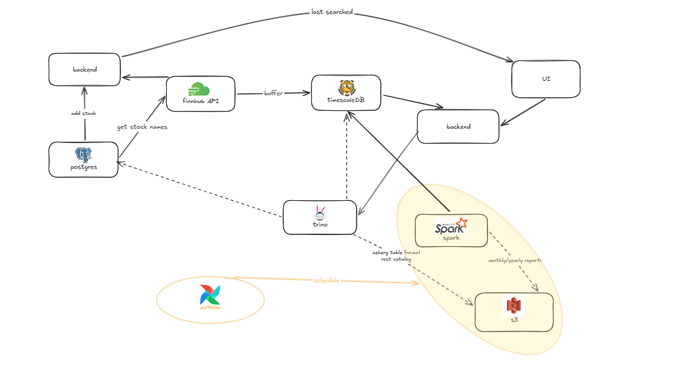
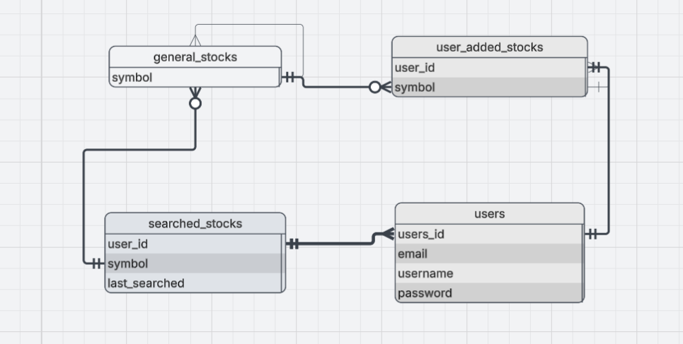
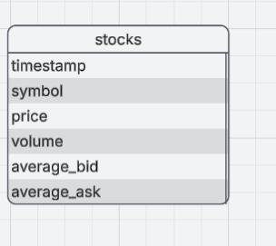

## 1. Project Overview
**Project Name:Stocks Analysis and forecast**  
**Date:20/04/2026**  

**Scenario / Story:**  
For anyone who is interested or involved in investing, and especially for
beginners that want to get into investing, stocks can get very complicated.
Understanding when to invest and where can be confusing for someone who never
studied it.
There are so many stocks and so many trends, in today's society a stock can get 
hyped up and forgotten the next week.
That's why there's a need of a service that does the job for you, one system that
lets you see all major stocks updated to the current time at one place (spark), 
lets you query them by top 10/50/etc , or by a type of stock (trino)
gives you reports on a regular basis , and alerts you when an unusual event happened
like a drastic rise or fall of a stock (airflow)
when all stocks and their data are stored in s3 or hdfs.

**Core Requirements:**  
The goals of the pipeline are:
- Provide updated data to the client. 
- Provide reports every determined amount of time (spark).
- Consider a forecast of the stocks for the future.
- Store the data on a distributed storage system (s3) that maintains high 
  availability and fault tolerance.
- Allow fast querying and filtering the stocks data (trino)
  

---

## 2. Data Characteristics
- **Data Types:** 
Using Finnhub API, stocks are returned as JSON file responses.
We'll store them as encoded parquet files, each being a 128MB.

- **Data Volume:**
One response from the Finnhub API will include a message type, last stock's 
price, it's symbol, volume and timestamp in JSON format.
The API returns the data for each second back (meaning - for each minute we get the 
stocks for the 60 seconds before).
That is pretty small, a request like the one below from the Finnhub API is only
about 21KB.
There are around 50000 stocks, so storing them would be 1GB per minute
, for the stocks hours (9:30-16:00) that is 1.5TB a day.
That is 450TB a year.
That also means that for each stock we're storing 45GB for 5 years.
But were converting the files to parquet, so each 1.5TB od JSON will be roughly 
about 250GB a day, meaning 917TB of data a year and 455TB across 5 years.
So each day we have about 1,953 parquet files being created. 

- **Arrival Frequency:**
Once a month (31/30.x.xxxx) we will generate a report of the previous month.
Once a year (1.1.xxxx,00:00) we will generate a report of the previous year.
Every minute the API will send the updated stocks to the UI.
And a client will have the ability to ask for another stock which will stay on
researched stocks.

- **Latency Requirements:**  
The batch processing divides into the reports batch and the stocks display batch.
The display batch cannot have higher latency than 15 minutes or the SLA will be bad.
Luckily a sparkMR node has 32C and about 1024GB, for processing 5GB every minute
that is barely any latency.
The reports batch processing (reports and before storage) can "suffer" higher latency 
since it will have less of an impact, it's not a real-time output but a scheduled 
once-a-day one.
Also, the batch processing of storing the stocks can have higher latency than actually
showing them to the client, but we can't have to big of a latency.
it's ok if while showing a stocks data from today the last 10 minutes don't show, 
it's not ok if the last 2 hours don't, a latency of an hour max is ok.
the reports include the entire day's stocks which is 1.5TB of data.
Again, the node's resources can handle those volumes of data.
The biggest report a user could ask for is for the entire market for 5 years back,
which is 917TB of data, we won't query every minute of the 5 years past because it
doesn't matter in such a large timespan, so above a month well query on an hourly basis 
which is 750GB.
we'll do the same with any timespan larger than a week.
between a day and a week we'll give updates based on data every 15 minutes.
the reports well be sent as an email to the client with a latency of upto an hour,
with an estimation of 40 minutes.

---

## 3. Pipeline Architecture
**End-to-End Diagram:**  

**Components & Responsibilities:**

- **Ingestion:**
    we'll ingest the data to a RAM buffer to insert it to the DB using micro batches 
    instead of batching everything at once to avoid latency spikes.

- **Storage (S3/HDFS):
    We will use s3 as storage.
    S3 use of tiers can help us with faster access for frequently accessed files.
    We'll organize our files in tiers by access frequency, the most successful 
    stocks and ones that were searched by the client/ asked to follow by the client 
    will be in the standard tier.
    Then files with average activity will be in the one zone-standard.
    Lastly files that consist smaller stocks with lower activity (what you can call
    a silent stock) will be in the one zone.
    hdfs doesn't offer us the option to divide files to tiers, which is why s3 was
    chosen.**

- **Processing (Spark):
    With spark we will do batch processing to create reports one a day of the stocks
    market status, that includes top stocks, biggest rises/falls etc...
    When a user will ask we'll create reports with statistics about the stock to 
    that certain timeframe he asked for, in addition to a monthly report.
    Spark will batch the stocks data at the end of every day to s3.
    Spark will also run a scheduled compaction process every week and month, and a daily list
    of the closing values.
    The reason spark was chosen and not pandas is that pandas isn't distributed
    but is entirely on one node, which does not satisfy the fault tolerance that is 
    needed for our system.**
    The statistics we calculate:
    We want to recommend the user other stocks to follow that are similar or have 
    better stats than the stocks the user follow.
    We also want to calculate - top closing values, highest bids, lowest bids, 
    biggest volumes, biggest/highest rises etc... and stats like RSI, Stochastic oscillator
    and more.

- **Orchestration (Airflow):
    With airflow we'll orchestrate the reports.
    While we could have user other tools like argo, it uses Kubernetes CronJob to 
    schedule workflows, and while cronjob could schedule the task, it won't orchestrate
    it. Airflow manages the task from top to bottom, and it manages to do so by writing 
    python code.
    Airflow was chosen instead of argo workflow since argo would be an overkill,
    out orchestration is relatively simple and argo is mainly for more complicated 
    ones.
    we'll need to schedule a yearly airflow process that deletes all the
    expired stocks (past 5 years).
    We'll also orchestrate a job once a day to batch the data and clear the DB and.
    Airflow will also schedule a weekly compaction process and a monthly and weekly report** 

- **Query Layer (Trino + SQL):
    We'll use trino to query the current stocks by top stocks, biggest rise, certain
    types of stocks, etc...
    If a client asks for data years back, we don't need to return every minute.
    We won't return all the data, but rather certain points in time, even the closing
    value every day will reduce the amount of data to retrieve to 35MB a year.
    We also need to add special rises or falls but those sizes are very stock-dependent 
    and not possible to pre-calculate.
    We'll use postgres to store the stocks name and symbol that we need to get 
    from the API.
    We'll use A DB (timescaleDB) to write the recent stocks from this week, and timescale 
    has a functionality that clears the last day at the start of every new day.**
    We also use postgres to store the user's info and the stocks that each user follows.
    We use timescaleDB because:
    - it is a postgres extension, doesn't require to set up a whole new service.
    - it has multiple built-in functionalities that let us perform statistics and 
      cleaning the db without external tools - saving the db maintaining headache.
    - it automatically partitions the db based on the timestamp and allows scaling - 
      which creates better availability.
    We chose postgres to store the stock's names and user data because it is a free 
    open source tool with many extensions, making it great and cheap to use.
    We need it for SQL querying so redis isn't an option.

---

## 4. Storage Design

- **Partitioning Strategy:**
In s3 we'll partition by stock symbol, that is the most critical partitioning we
can have since it will probably be the most used one.
we'll also partition by dates.
In timescaleDB data is automatically partitioned by timestamp.

- **File Formats:** (Parquet/ORC/etc.)  
All files will be stored in Parquet format, each file being 128MB.
Every stock being returned in a response from the API will be written to a file
and not saved on its own but with other stocks being written in the same file 
until we reached 128MB (batch).
Parquet file is the preferable format since it uses columnar format which fastens 
querying.
Parquet was chosen and not OCR or ccsv because it allows dictionary encoding, 
it has faster serialization/deserialization.
Parquet is known for being good for read-heavy systems (which ours is) and a great
tool for analytics. It's known for working well with sparks for analytics. 

- **Lifecycle Policies / Retention:**
A file will include the stocks name, the stocks details like price, 
it's symbol, volume and timestamp.
Since we talk about stocks an expiration of 5 years should be enough, that way the 
client can see the stats of the stock from a satisfied amount of time before, but
we don't overload the storage with data from 30 years back.
In the DB data will only be stored for a day, we want it for updated data.

- **Include ERD (SQL)**
postgres:

timescaleDB:

---

## 5. Processing Design (Spark)
- **Job Structure / Pipelines:**  
Spark will write the stocks to a parquet file, each being 128MB.
Once a file reached 128MB or a certain time limit (1 minutes) has passed, the file
is closed and batched to the storage.
because we're batching up to 1.5TB a day, we'll open files as concurrent jobs.

- **Transformations / Aggregations:**  
spark will: calculate the top 20 stocks and pass it to the DB.
During reports, it will calculate the most successful stocks, highest rises, biggest
falls, charts etc...
for that we'll need a lot of group by, functions (avg, first, etc...), filters, and
for per-user metrics we'll need Joins, distributed joins since our tables are large,
and we do not want to broadcast them.

- **Retries / Failure Handling:**
Spark has a built-in retry policy, if an executor will fail it will try to retry 
task on another executor until a specific number of time (by default 4).
The integration of spark with iceberg makes it good for handling fault tolerance
since if a spark job failed spark would know since it's missing a success file, 
but if spark entirely failed there wouldn't even be a mid-write file, either the change
was made or it wasn't since iceberg is atomic.

- **Scalability Considerations:**  
Data-wise, because spark and trino are both able to work with much bigger data amounts,
(a kubernetes node for an example has 32C and 1024GB in sparkMR, we're only processing
about 1.5TB a day), then a large amount of stocks adding really isn't a problem.
We'll use the dynamic allocator with a given start of 5 executors with each having 8GB.

---

## 6. Orchestration Design (Airflow)
- **DAG Structure / Dependencies:**
we have 1 airflow DAG, in this DAG we need to:
- Create a task that makes spark extract the relevant data from s3.
- Create a task that makes spark compute the stats and metrics on the data.
- Create a task that makes spark write a report of the results to iceberg.
- Create a task that validates the data.
for that we'll need mostly spark submit operators, and python operators.

- **Scheduling:**
the first one schedules the batch monthly reports, in which airflow needs at 01/xx
of every month at 00:00 to trigger a spark job that will create the report.
the batching of every weeks data will be scheduled at sunday 00:00.
the batching of the stocks every minute will be done with a simple cronjob since 
there's no point of using airflow DAGS every minute.

- **Retries & Backfills:**  
Airflow has a retry policy where it can be retried up to 3 times, we'll configure a 
5 minutes break between retries.

- **Monitoring & Alerting:**  
The measurements well take to monitor the DAGS and alert when needed:
- Set callbacks for success/failure for all DAGS, when failed we'll notify.
- Set deadline alerts for the reports of 12 hours.
- Set up email notifications when a DAG fails.
- Alert when DAG exceeds 12 hours or weekly/monthly report exceeds 9 hours.
- When it comes to the cronjob alert if data wasn't sent in 2 minutes, make sure 
runtime doesn't exceed 60 seconds, and log the insert duration - to know if there 
are spikes.
---

## 7.Trino
- **Query Patterns:**
User requests can look like- 
"top 20 stocks yesterday"
"stock with the highest rise"
"stocks with the best closing value this month"
That means query patters will look like-
"SELECT xx WHERE symbol= xx AND timestamp= xx LIMIT 20".

- **Optimizations (joins, partition pruning, aggregations):**
We'll want to use FTE mode for larger queries where we don't want to have to repeat
the whole query and calculations, the FTE spooling allows us to avoid that.
we also want to use predicate pushdown and partition pruning to avoid unnecessary 
data scans.

- **Trade-offs / Limitations:**  
A query shouldn't take over 5 minutes, because it becomes irrelevant.

---

## 8. Operational Considerations
- **Monitoring / Logging:** 
monitoring and logging are described in the airflow section.

- **Failure Recovery:**  
If spark fails:
If it's only a batch process we can retry the job, if we're past 1 minute we won't try
anymore.
If an executor fail spark will recognize it and pass the data to another executor 
which might cause higher latency for reports since the work is less distributed now.
It shouldn't cause problems for the stocks mini batch since the data volume of each
batch is relatively small.
if spark entirely fails we'll have to wait for it to restart, after which we'll 
recognize what stocks weren't written. here too we might suffer from higher latency 
since we'll have a large amount of stocks pile up.
If trino fails:
If trino entirely fails, the user won't be able to query the storage, if it was 
mid-query the user will have to re-query.
If it was just an executor, the task will be retried on a different worker or the 
entire job will be retried, with FTE the data can be restored from disk.
If the backend service fails the user won't be able to search for new stocks or
submit to them.
If the other backend service fails we won't be able to show data from the DB to the user
and the stocks will be stuck on one timestamp.
If postgres/timescaleDB fails:
we'll have backup instances of both, making sure there's always a db available.
postgres (and by default also timescaleDB) offers many functions that provide a 
backup db (pg_dump,pgbasebackup) for both logical and physical backup db.
We'll rather use basebackup that copies the cluster files, we'll create it in Continuous 
Archiving mode for it to constantly update.

- **Scaling:**  

---

## 9. Trade-offs & Limitations
- **Pros:**
The design makes usage of the TS data, and stores it in a TSDB for best practice.
The choice of timescaleDB - which is a TSDB but also an extension of postgres, 
prevents the cost of setting up another service, but also prevents partitioning
the data (timescale does it automatically) and provides us with time series functionality.
The use of iceberg with s3 allows us to have the tiers that manage data priority and
an object storage that could be considered easier to manage, but also provides
consistency and ACID principle since we use iceberg catalog.
The design divides the data to both easy access short term data (weekly stocks in 
timescale tables) and longer term, harder to access data (s3) in which the use of 
trino exceeds since it's the best at querying more than one data source.

- **Cons:**
The write volumes to the db are extremely high and could cause a bottleneck on the
DB. And metrics lack a source of truth since both trino , spark and timescale
run queries.

- **Alternative Designs Considered:**  
One of the designs considered was making the data real-time to the client, meaning 
we'll do streaming instead of batching every minute. That involved a websocket that
streams non-stop instead of an http request, which would later be ingested by kafka
and then flink that would make aggregations and pass the data to the UI (through a backend).
The reports involving spark stay the same.
The reason this design wasn't chosen is that real time data is more relevant to
shorts selling, active stocks trade and that isn't the project's purpose.

---

## 10. Future Improvements
- **Scaling Strategies:**  
- **Performance Tuning:**
create pre-calculated metrics of days to make it easier for larger time spans while
computing metrics.

- **Automation / Observability:** 
In the future we'd like to integrate tools like fluentD and statsD to capture logs 
and gather metrics on airflow, which by integrating with elastic or prometheus too 
we can monitor.

- **Other Enhancements:**  

---
