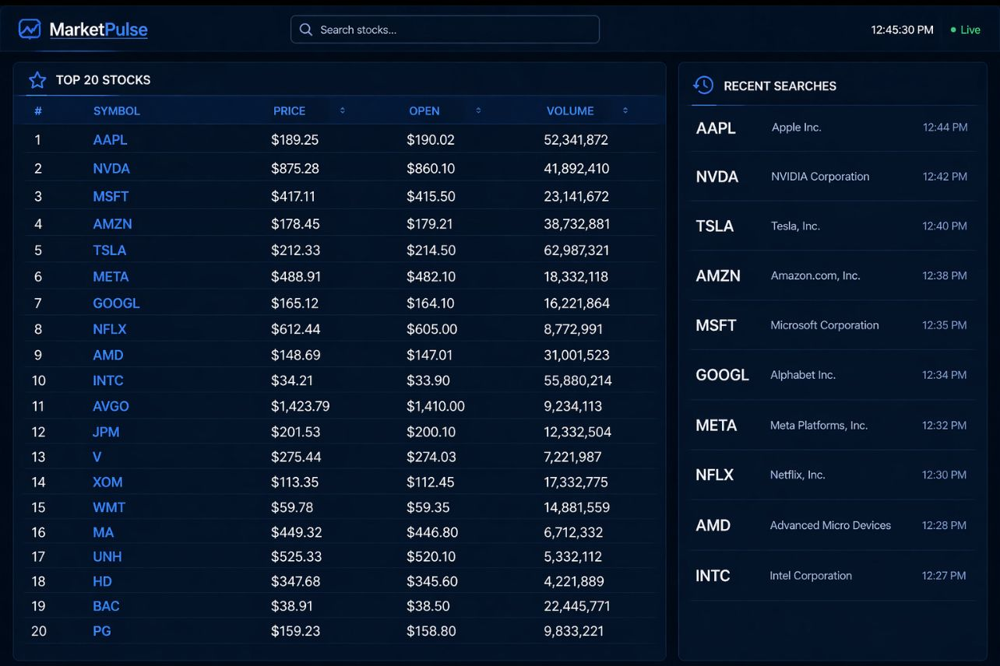
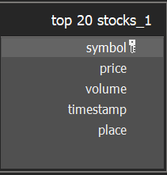
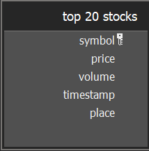

## 1. Project Overview
**Project Name:Stocks Analysis and forecast**  
**Date:20/04/2026**  

**Scenario / Story:**  
For anyone who is interested or involved in investing, and especially for
beginners that want to get into investing, stocks can get very complicated.
Understanding when to invest and where can be confusing for someone who never
studied it.
There are so many stocks and so many trends, in today's society a stock can get 
hyped up and forgotten the next week.
That's why there's a need of a service that does the job for you, one system that
lets you see all major stocks updated to the current time at one place (spark), 
lets you query them by top 10/50/etc , or by a type of stock (trino)
gives you reports on a regular basis , and alerts you when an unusual event happened
like a drastic rise or fall of a stock (airflow)
when all stocks and their data are stored in s3 or hdfs.

**Core Requirements:**  
The goals of the pipeline are:
- Stream large amount of stocks data (Flink & kafka). 
- Provide updated data to the client. 
- Ad-hoc : alert when an unusual event has happened.
- Provide reports every determined amount of time (spark).
- Consider a forecast of the stocks for the future.
- Store the data on a distributed storage system (s3) that maintains high 
  availability and fault tolerance.
- Allow fast querying and filtering the stocks data (trino)
  

---

## 2. Data Characteristics
- **Data Types:** 
Using Finnhub API, stocks are returned as parquet file responses.
We'll store them as encoded parquet files, each being a 128MB.

- **Data Volume:**
One response from the Finnhub API will include a message type, last stock's 
price, it's symbol, volume and timestamp in JSON format.
That is pretty small, a request like the one below from the Finnhub API is only
about 88-100B.
There are around 6000-7000 US stocks, so storing them would be 585MB a second
which is 34GB a minute and 2TB an hour.
That is 17PB a year.
That also means that for each stock we're storing 14.6TB for 5 years.

- **Arrival Frequency:**
Once a day (00:00) we will generate a report of the day before (batch).
Once a month (31/30.x.xxxx) we will generate a report of the previous month.
Once a year (1.1.xxxx,00:00) we will generate a report of the previous year.
Every time a client will connect to the application we'll load the stocks from 
the API (not all stocks, we can do top 20).
And a client will have the ability to ask for another stock which will stay on
researched stocks.

- **Latency Requirements:**  
Latency is a very important subject that we have to deal with, when we talk about 
streaming that is done non-stop with this type of data, we need to have as minimal
latency as possible. Both on the client side and the server side since it has direct
affect on the client side (a latency in processing will cause a delay on the client
side.)
We can't use micro-batch before the client sees the data since stocks change 
frequently and can drastically change in a matter of a few seconds - so 
streaming is necessary.
The batch processing (reports and before storage) can "suffer" higher latency 
since it will have less of an impact, its not a real-time output but a scheduled 
once-a-day one.
Also, the batch processing of storing the stocks can have higher latency than actually
showing them to the client, but we can't have to big of a latency.
it's ok if while showing a stocks data from today the last 10 minutes don't show, 
it's not ok if the last 2 hours don't, a latency of an hour max is ok.
---

## 3. Pipeline Architecture
**End-to-End Diagram:**  

**Components & Responsibilities:**

- **Ingestion:
    with kafka we ingest the data before using spark for batch processing.
    We chose kafka because of the very low latency which is good for real-time, 
    and it prevents data loss (hold data in various brokers) which would help us 
    maintain fault tolerance.**

- **Storage (S3/HDFS):
    We will use s3 as storage.
    S3 use of tiers can help us with faster access for frequently accessed files.
    We'll organize our files in tiers by access frequency, the most successful 
    stocks and ones that were searched by the client/ asked to follow by the client 
    will be in the standard tier.
    Then files with average activity will be in the one zone-standard.
    Lastly files that consist smaller stocks with lower activity (what you can call
    a silent stock) will be in the one zone.
    hdfs doesn't offer us the option to divide files to tiers, which is why s3 was
    chosen.**

- **Processing (Spark):
    With spark we will do batch processing to create reports one a day of the stocks
    market status, that includes top stocks, biggest rises/falls etc...
    We don't use spark for streaming since it might struggle with performance 
    degradation in larger data amounts, however flink is great for streaming, and it's
    caching abilities provide very low latency compared to spark streaming.
    The reason spark was chosen and not pandas is that pandas isn't distributed
    but is entirely on one node, which does not satisfy the fault tolerance that is 
    needed for our system.**

- **Orchestration (Airflow):
    With airflow we'll orchestrate the reports.
    While we could have user other tools like argo, it uses Kubernetes CronJob to 
    schedule workflows, and while cronjob could schedule the task, it won't orchestrate
    it. Airflow manages the task from top to bottom, and it manages to do so by writing 
    python code.
    Airflow was chosen instead of argo workflow since argo would be an overkill,
    out orchestration is relatively simple and argo is mainly for more complicated 
    ones.
    we'll also need to schedule a yearly airflow process that deletes all the
    expired stocks (past 5 years).
    We'll also orchestrate a job once a day to clear the DB.** 

- **Query Layer (Trino + SQL):
    We'll use trino to query the current stocks by top stocks, biggest rise, certain
    types of stocks, etc...
    From the storage the heaviest query we can run is to get all stock places from
    5 years ago until now, and in the worst case scenario of the user always being 
    logged in that's 157680000 seconds of streaming the same stock.
    that means we need 15768000*100MB (a stock response's size) so we need ~ 14.5TB
    of data to be returned.
    on trino it is possible to return about 43TB of information in less than an hour
    meaning that returning 14.6TB should take less than 20 minutes.
    but that's still too much, so we won't return all the data, but rather certain 
    points in time, if we return the stock every 20 days the query will take less 
    than a minute. 
    We also need to add special rises or falls but those sizes are very stock-dependent 
    and not possible to pre-calculate.
    We'll use postgres to store the stocks name and symbol that we need to get 
    from the API.
    We'll use A TSDB to write the recent stocks from this day, and we'll schedule
    daily airflow tasks to clear the DB.**
 
---

## 4. Storage Design

- **Partitioning Strategy:**
we'll partition by stock symbol, that is the most critical partitioning we
can have since it will probably be the most used one.

- **File Formats:** (Parquet/ORC/etc.)  
All files will be stored in Parquet format, each file being 128MB.
Every stock being returned in a response from the API will be written to a file
and not saved on its own but with other stocks being written in the same file 
until we reached 128MB (batch).
Parquet file is the preferable format since it uses columnar format which fastens 
querying.

- **Lifecycle Policies / Retention:**
A file will include the stocks name, the stocks details like price, 
it's symbol, volume and timestamp.
Since we talk about stocks an expiration of 5 years should be enough, that way the 
client can see the stats of the stock from a satisfied amount of time before, but
we don't overload the storage with data from 30 years back.
In the DB data will only be stored for a day, we want it for updated data.

- **Include ERD (SQL)**
Top 20 stocks today:

searched stocks (about 10 latest):

---

## 5. Processing Design (Spark)
- **Job Structure / Pipelines:**  
Spark will write the stocks to a parquet file, each being 128MB.
Once a file reached 128MB or a certain time limit (3 minutes) has passed, the file
is closed and batched to the storage.
because we can update up to 585MB a second, we'll open 5 files as concurrent jobs.

- **Transformations / Aggregations:**  
- **Retries / Failure Handling:**  
- **Scalability Considerations:**  

---

## 6. Orchestration Design (Airflow)
- **DAG Structure / Dependencies:**  
- **Scheduling:**  
- **Retries & Backfills:**  
- **Monitoring & Alerting:**  

---

## 7.Trino
- **Query Patterns:**  
- **Optimizations (joins, partition pruning, aggregations):**  
- **Trade-offs / Limitations:**  

---

## 8. Operational Considerations
- **Monitoring / Logging:**  
- **Failure Recovery:**  
- **Scaling:**  

---

## 9. Trade-offs & Limitations
- **Pros:**  
- **Cons:**  
- **Alternative Designs Considered:**  

---

## 10. Future Improvements
- **Scaling Strategies:**  
- **Performance Tuning:**  
- **Automation / Observability:**  
- **Other Enhancements:**  

---
